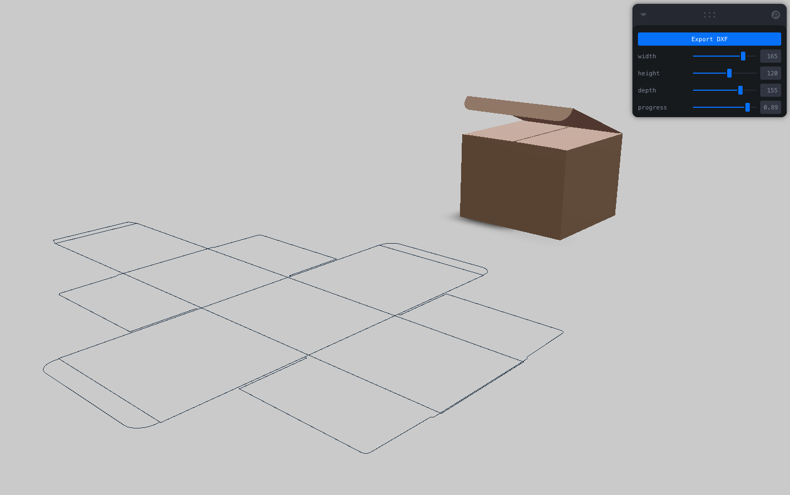

# Nodi Modular Sample - Foldingbox Package Generator

A packaging box (carton box) drawing generation application powered by Nodi-Modular, featuring interactive 3D visualization and DXF export capabilities.

## Features




- **Export DXF**: Export box development drawings in DXF format for manufacturing
- **Adjust W/H/D**: Freely adjust box width, depth, and height with real-time preview
- **3D Visualization**: Interactive 3D rendering of both mesh geometries and curves
- **Surface Detection**: Intelligent surface geometry rendering with optimized materials

## Getting Started

1. Install dependencies:
```bash
npm install
```

2. Start the development server:
```bash
npm run dev
```

3. Open your browser and navigate to `http://localhost:5173`

## Available Scripts

- `npm run dev` - Start development server
- `npm run build` - Build for production
- `npm run preview` - Preview production build
- `npm run lint` - Run ESLint

## Tech Stack

- **Frontend**: React 18 + TypeScript
- **3D Rendering**: Three.js with @react-three/fiber and @react-three/drei
- **Build Tool**: Vite with WASM and top-level await plugins
- **UI Controls**: Leva for real-time parameter adjustment
- **WebAssembly**: nodi-modular (v0.0.22) for computational geometry
- **Export**: dxf-writer for DXF file generation

## Nodi Project Source

This application uses the following Nodi project:
[https://app.nodi3d.com/2e8f73bd-6446-4a0b-a404-e89b480b65a0](https://app.nodi3d.com/2e8f73bd-6446-4a0b-a404-e89b480b65a0)

**Note**: When exporting, please ensure the nodi-modular package version matches your project requirements.


## How It Works

1. **WebAssembly Initialization**: The app initializes the nodi-modular WASM module using top-level await
2. **Graph Loading**: Loads the predefined foldingbox node graph (foldingbox.json) containing packaging geometry logic
3. **Interactive Controls**: Leva automatically generates GUI controls for node parameters (width, height, depth, etc.)
4. **Real-time Updates**: Parameter changes trigger debounced graph re-evaluation to prevent UI freezing
5. **Geometry Processing**: Separates mesh geometries from curve geometries for optimized rendering
6. **Surface Detection**: Identifies surface-derived meshes and applies specialized materials for consistent appearance
7. **3D Visualization**: Renders geometries using Three.js with:
   - Mesh geometries: Flat-shaded materials with reduced environment mapping
   - Curve geometries: Line rendering for fold lines and cut patterns
   - Optimized normal vectors for uniform lighting
8. **DXF Export**: Converts curve geometries to 2D polylines and exports as DXF files for manufacturing