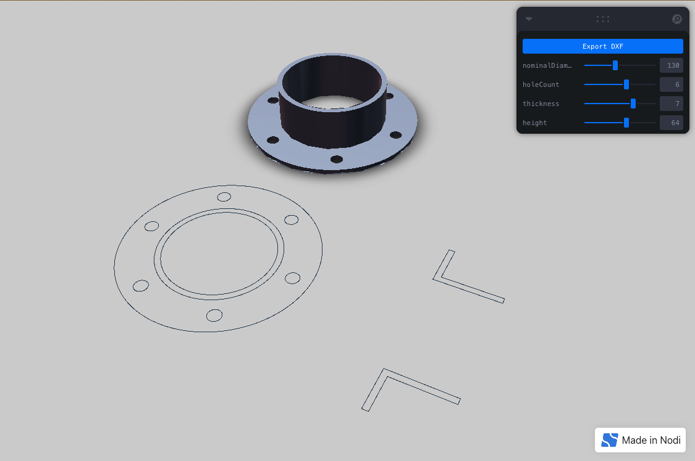

# Nodi Modular Sample - Frange Configurator

A Frange (pipe flange) component configurator built with the nodi-modular library, featuring interactive 3D visualization and technical drawing export capabilities.

## Features



- **Export DXF**: Download Frange technical drawings (3-view projections) in DXF format for manufacturing
- **Adjust Size**: Modify nominal diameter, number of holes, and other flange parameters in real-time
- **3D Visualization**: Interactive 3D rendering of both mesh geometries and construction curves
- **Real-time Updates**: Instant visual feedback when adjusting flange parameters

## Getting Started

1. Install dependencies:
```bash
npm install
```

2. Start the development server:
```bash
npm run dev
```

3. Open your browser and navigate to `http://localhost:5173`

## Available Scripts

- `npm run dev` - Start development server
- `npm run build` - Build for production
- `npm run preview` - Preview production build
- `npm run lint` - Run ESLint

## Tech Stack

- **Frontend**: React 18 + TypeScript
- **3D Rendering**: Three.js with @react-three/fiber and @react-three/drei
- **Build Tool**: Vite with WASM and top-level await plugins
- **UI Controls**: Leva for real-time parameter adjustment
- **WebAssembly**: nodi-modular (v0.0.22) for computational geometry
- **Export**: dxf-writer for DXF file generation

## Nodi Project Source

This application uses the following Nodi project:
[https://app.nodi3d.com/d94b2c12-6567-4259-b808-a4dc253c8394](https://app.nodi3d.com/d94b2c12-6567-4259-b808-a4dc253c8394)

**Note**: When exporting, please ensure the nodi-modular package version matches your project requirements.

## How It Works

1. **WebAssembly Initialization**: The app initializes the nodi-modular WASM module using top-level await
2. **Graph Loading**: Loads the predefined frange node graph (frange.json) containing pipe flange geometry algorithms
3. **Interactive Controls**: Leva automatically generates GUI controls for flange parameters (nominal diameter, bolt holes, thickness, etc.)
4. **Real-time Updates**: Parameter changes trigger debounced graph re-evaluation to prevent UI freezing
5. **Geometry Processing**: Separates mesh geometries from curve geometries for optimized rendering
6. **3D Visualization**: Renders geometries using Three.js with:
   - Mesh geometries: Flange body with realistic materials and lighting
   - Curve geometries: Construction lines, bolt hole patterns, and technical annotations
   - Optimized normal vectors for uniform appearance
7. **DXF Export**: Converts curve geometries to 2D technical drawings and exports as DXF files for CAD/manufacturing workflows

