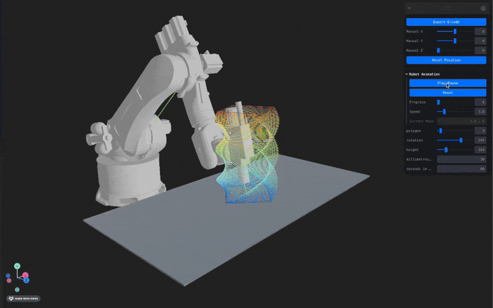

# Nodi Modular Sample - Robot Arm Simulator & G-code Visualizer

A sophisticated 3D robot arm simulator and G-code visualizer built with the nodi-modular library, featuring real-time 3D visualization, parametric geometric modeling, and robot path animation for robotics and 3D printing workflows.

## Features



- **Export G-code**: Download G-code files for 3D printing and CNC machining workflows
- **Real-time Animation**: Animated robot arm following toolpath with configurable speed control
- **URDF Support**: KUKA-style robotic arm simulation with kinematic visualization
- **Parametric Modeling**: Real-time geometry generation from node graphs with interactive parameters

## Getting Started

1. Install dependencies:
```bash
npm install
```

2. Start the development server:
```bash
npm run dev
```

3. Open your browser and navigate to `http://localhost:5173`

## Available Scripts

- `npm run dev` - Start development server
- `npm run build` - Build for production
- `npm run preview` - Preview production build
- `npm run lint` - Run ESLint

## Tech Stack

- **Frontend**: React 18 + TypeScript
- **3D Rendering**: Three.js with @react-three/fiber and @react-three/drei
- **Build Tool**: Vite with WASM and top-level await plugins
- **UI Controls**: Leva for real-time parameter adjustment
- **WebAssembly**: nodi-modular (v0.0.22) for computational geometry
- **State Management**: Zustand for robot animation and modular geometry state
- **Robot Simulation**: URDF loader for robotic arm kinematics

## Nodi Project Source

This application uses the following Nodi project containing parametric polygon tool geometry:
- **Project**: Parametric polygon tool generator
- **Features**: Adjustable polygon parameters (sides, rotation, height, etc.)
- **Graph File**: `polygonstool.json` containing the node graph definition

**Note**: When exporting, please ensure the nodi-modular package version matches your project requirements.

## How It Works

1. **WebAssembly Initialization**: The app initializes the nodi-modular WASM module using top-level await
2. **Graph Loading**: Loads the predefined polygon tool node graph (polygonstool.json) containing parametric geometry algorithms
3. **Interactive Controls**: Leva automatically generates GUI controls for geometry parameters (polygon sides, rotation, height, etc.)
4. **Real-time Updates**: Parameter changes trigger debounced graph re-evaluation (150ms) to prevent UI freezing
5. **Geometry Processing**: Separates mesh geometries from curve geometries for optimized rendering:
   - Mesh geometries: 3D polygon tool body with realistic materials and lighting
   - Curve geometries: Toolpath lines converted to G-code moves for robot animation
6. **Robot Animation System**: 
   - Converts curve geometries to G-code move sequences
   - Animates URDF robot arm following the toolpath
   - Provides playback controls (play/pause/reset/speed adjustment)
7. **Heatmap Visualization**: Custom Line2-based rendering with vertex colors:
   - Z-coordinate based color mapping (blue→cyan→green→yellow→red)
   - Smooth gradients using Three.js LineMaterial with vertex colors
   - Proper rendering integration with scene rotation and lighting
8. **G-code Export**: Processes curve geometries and exports compatible G-code files for manufacturing workflows
9. **Manual Control**: Interactive robot arm positioning with real-time inverse kinematics

## Key Components

- **URDFRobotArm**: KUKA-style robot arm with URDF-based kinematics
- **HeatmapLine**: Custom Z-axis based color-coded line visualization
- **AnimationControls**: Playback interface for robot path animation
- **Robot Animation Store**: Zustand-based state management for animation timeline
- **Modular Store**: Geometry and node graph state management
- **G-code Parser**: Conversion between curve geometries and G-code format